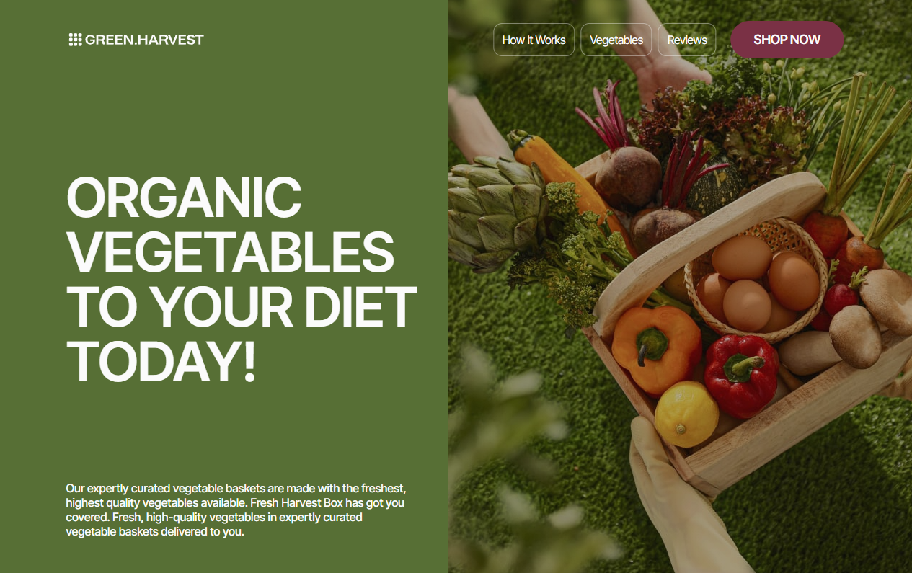
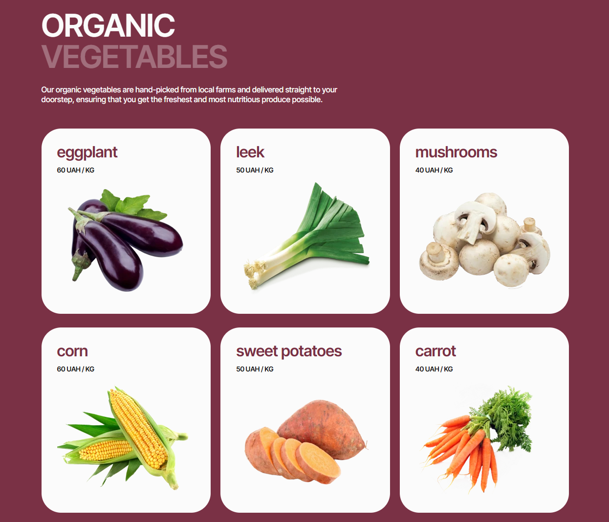
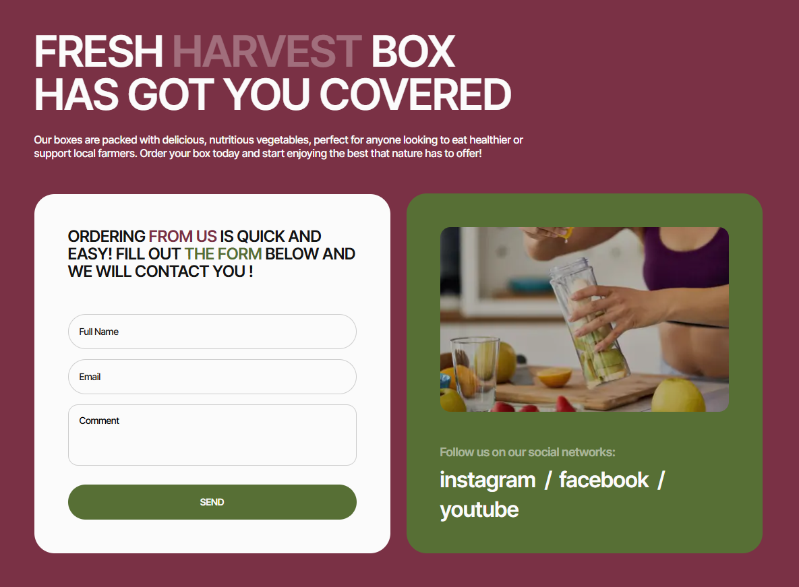
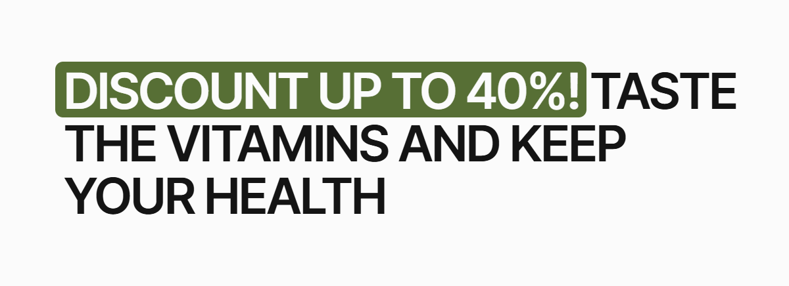
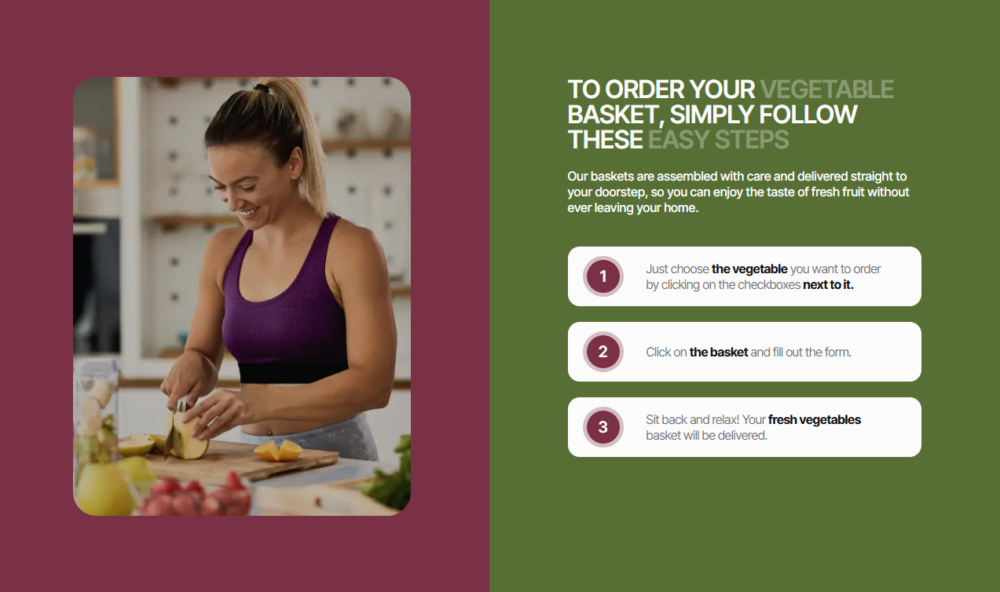
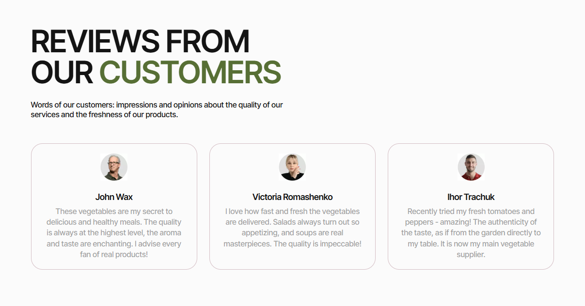
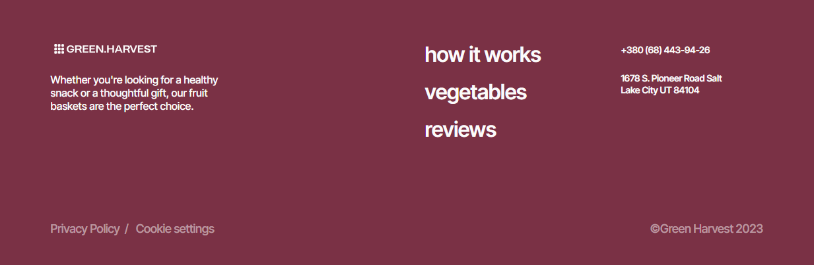
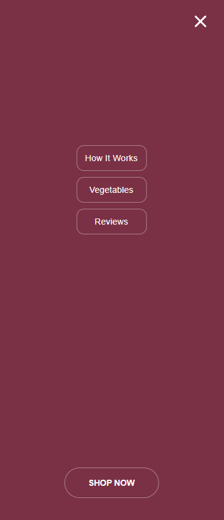

# Team project: green harvest

### Description:

This is a website focused on selling organic vegetables. The site provides an
opportunity users to get acquainted with a variety of vegetables, their prices,
characteristics and availability, and get advice from the seller through a
special feedback form. The site provides an intuitive interface, responsive
design for mobile devices and smooth animations for improvement user
interaction.

---

### Features:

1. **Interface:**

   - Stylish and natural design, emphasizing the organic nature of products.
   - Easy navigation: quick access to information about vegetables and the
     opportunity view prices and availability.
   - Detailed information about each product (photo, price, description,
     availability).

   

2. **Section with products:**

   - List of vegetables with images, prices and descriptions.

   

3. **Section for communication with the seller:**

   - Users can send a message to the seller through the form by specifying name,
     email and inquiry.
   - The feedback form helps to quickly get advice on Products.

   

4. **Advantages of organic products:**

   - The site has a special section telling about the benefits of organic
     vegetables for health and environment.

   

5. **Animations and Effects:**

   - Smooth animations and effects when hovering over elements for improvement
     user experience.
   - Interaction with site elements becomes more intuitive and pleasant.

   

---

### Stages of implementation:

1. **Interface design:**

   - Development of site layouts with an emphasis on natural colors and
     simplicity use.
   - Choice of fonts and colors that emphasize eco-oriented themes the Site.

   

2. **Testing:**

   - Testing the site on different devices and browsers to ensure adaptability
     and stability across all platforms.

   

3. **Launch and support:**

   - Publishing a site on the Internet and then updating based on the reverse
     user communications.

   

---

### Advantages of using:

- **Convenience of shopping**: Easy access to all available vegetables, theirs
  characteristics and prices.
- **Feedback form**: Ability to quickly contact the seller for obtaining
  consultations.
- **Advantages of organic products**: Information on the benefits of organic
  vegetables and their impact on health.
- **Adaptability**: Convenient use on any device - smartphones, tablets,
  desktops.

---

### Technologies used:

1. **Programming languages:**

   - **JavaScript**

2. **Other technologies:**

   - **Git** (for version control).

3. **Adaptability:**
   - Use **CSS Media Queries** to ensure adaptability.
   - **Flexbox** for flexible arrangement of elements on different devices.

---

This site helps users find quality organic vegetables, get acquainted with their
characteristics and prices, as well as get advice from the seller via feedback
form. Thanks to adaptive design, the site is optimized for use on different
devices.
